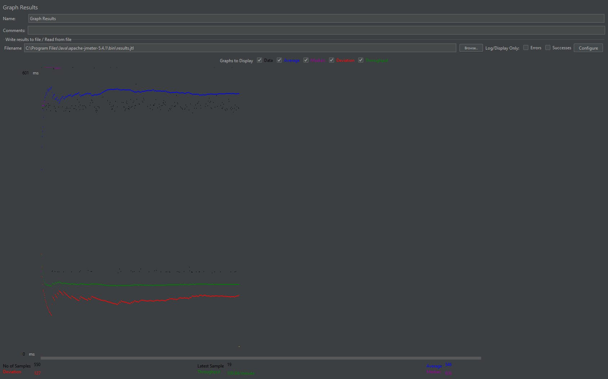
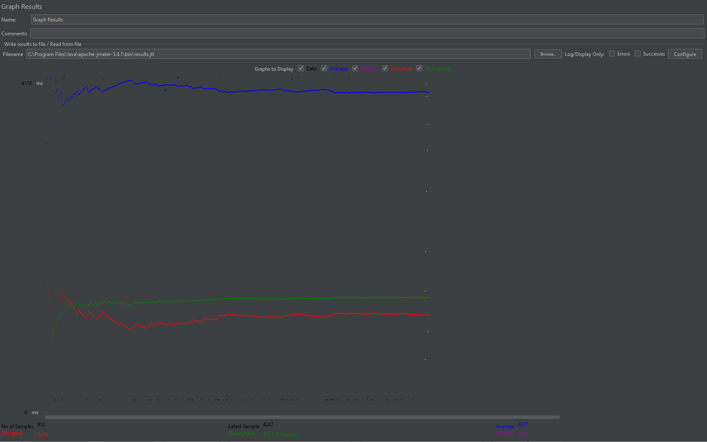
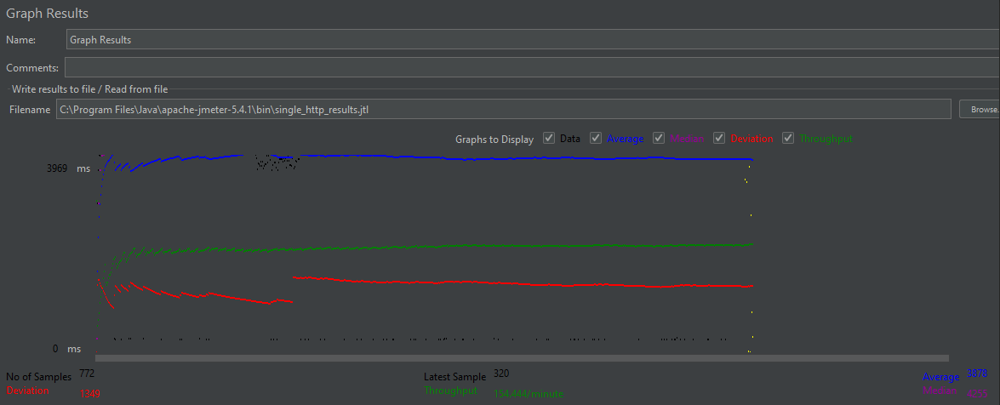
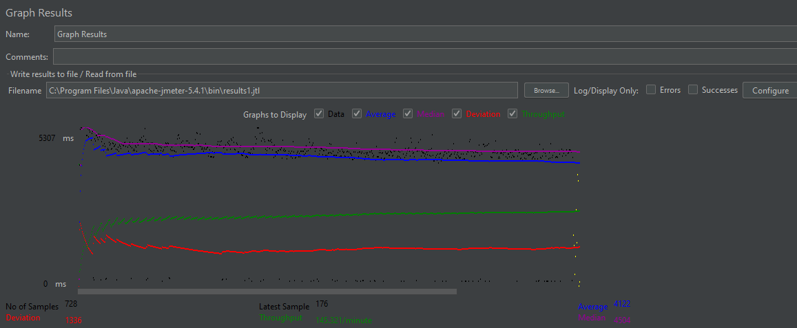
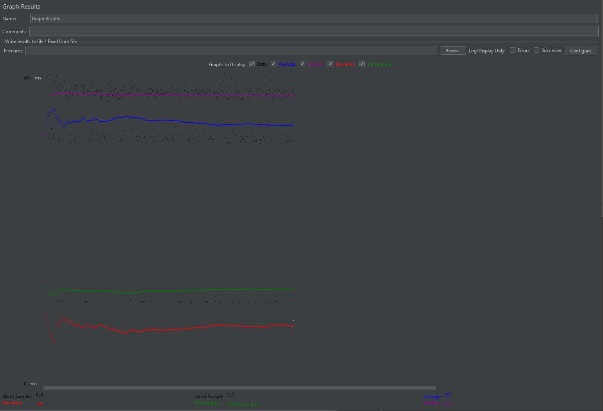
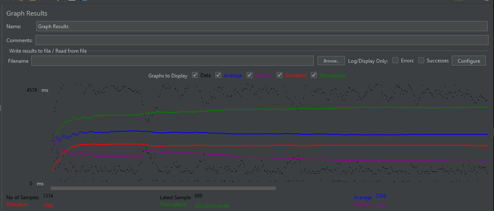

- # General

  - #### Overview:

    A movie database that offers searching through movies as well as showing movie details such as associated actors, directors, and publishing date.

    **Technical Features:**

      A full-stack web application using the RESTful API that utilizes MySQL for the database.
      For the front-end, this web application uses HTML, CSS, and JavaScript using AJAX to send
      requests to the backend using Java Servlets. This web application is hosted on Apache Tomcat and
      is able to utilize Apache2 to handle load balancing for large scale user traffic. This web
      application also features an android app that displays this web application on Android.

      **Notable features of this web application:**  
        - HTTPS redirection  
        - Full-text search and Autocomplete  
        - Android App Platform
        - MySQL Replication  
        - Load Balancing using Apache2  
        - Connection Pooling  
        - ReCAPTCHA  
        - Prepared Statements to prevent MySQL injection attacks  
        - Stored Procedures

  - #### Instruction of deployment:

    Deploying this application with Tomcat requires Maven which using
    ```mvn package```
    will create a war file which deploying in Tomcat webapps directory
    will launch and run this web application. 

- # JMeter TS/TJ Time Measurement Report

| **Single-instance Version Test Plan**         | **Graph Results Screenshot**  | **Average Query Time(ms)** | **Average Search Servlet Time(ms)** | **Average JDBC Time(ms)** | **Analysis**                                                                                                                                                                                                                                                                                                                                                                                                                                                               |
| --------------------------------------------- | ----------------------------- | -------------------------- | ----------------------------------- | ------------------------- | -------------------------------------------------------------------------------------------------------------------------------------------------------------------------------------------------------------------------------------------------------------------------------------------------------------------------------------------------------------------------------------------------------------------------------------------------------------------------- |
| Case 1: HTTP/1 thread                         |  | 546                        | 322.810896                          | 322.760726                | This test plan and the scaled test plan with 1 thread are similar in the report times. Siince it is only running one thread, there is less stress on the server so it will be significantly faster compared to using multiple threads as shown in case 2/3.                                                                                                                                                                                                                |
| Case 2: HTTP/10 threads                       |  | 3927                       | 476.618717                          | 476.518858                | This test case is similar in query time with case 3 which uses https. Since it uses a much more threads compared to one thread (case 1), it is significantly slower. It is also slower than the scaled version that uses multiple threads since the single instance version can not handle a heavy load as efficiently compared to the scaled version.                                                                                                                     |
| Case 3: HTTPS/10 threads                      |  | 3878                       | 487.04293                           | 486.969947                | This test case is similar in report times with case 2 which uses http. Compared to sing a single thread, it runs significantly slower since the multiple threads will be more demanding on the server. However, it is faster than using the same number of threads without connection pooling because it is able to grab a preallocated connection everytime a request is made rather than having to go through the process of creating a new connection for each request. |
| Case 4: HTTP/10 threads/No connection pooling |  | 4122                       | 664.201858                          | 643.614553                | No connection pooling will slow down the average query times because every request needs to create a new connection and process a query rather than simply grabbing a connection from a preallocated pool. This test plan in particular has the slowest avg query time because compared to the scaled no pooling test plan, it takes longer for the single instance since the scaled versions were created to handle more load.                                            |

| **Scaled Version Test Plan**                  | **Graph Results Screenshot**         | **Average Query Time(ms)** | **Average Search Servlet Time(ms)** | **Average JDBC Time(ms)** | **Analysis**                                                                                                                                                                                                                                                                                                                                                                                              |
| --------------------------------------------- | ------------------------------------ | -------------------------- | ----------------------------------- | ------------------------- | --------------------------------------------------------------------------------------------------------------------------------------------------------------------------------------------------------------------------------------------------------------------------------------------------------------------------------------------------------------------------------------------------------- |
| Case 1: HTTP/1 thread                         |  | 551                        | 327.542128                          | 327.293109                | This test plan has one of the fastest report times alongside the single instance version using one thread. Since it only uses one thread, it can handle requests and queries much faster compared to using multiple threads as seen in case 2 of the scaled version.                                                                                                                                      |
| Case 2: HTTP/10 threads                       |  | 2066                       | 285.730807                          | 285.60584                 | Compared to the single thread scaled test plan, this is much slower since it uses multiple threads which demands more from the server to execute the queries. This test plan however is faster than the single instance test that uses multiple threads (case 2/3) because the scaled version can manage a heavier load; thus, working faster with 10 threads compared to the single instance test plans. |
| Case 3: HTTP/10 threads/No connection pooling |  | 2284                       | 317.665049                          | 301.53230                 | No connection pooling slows down the average query times because every request needs to create a new connection and process a query rather than grabbing a preallocated connection from the pool. This test plan is a little faster than the single instance test plan with no pooling since the scaled version can manage a heavier load, thus executing queries a little faster.                        |
