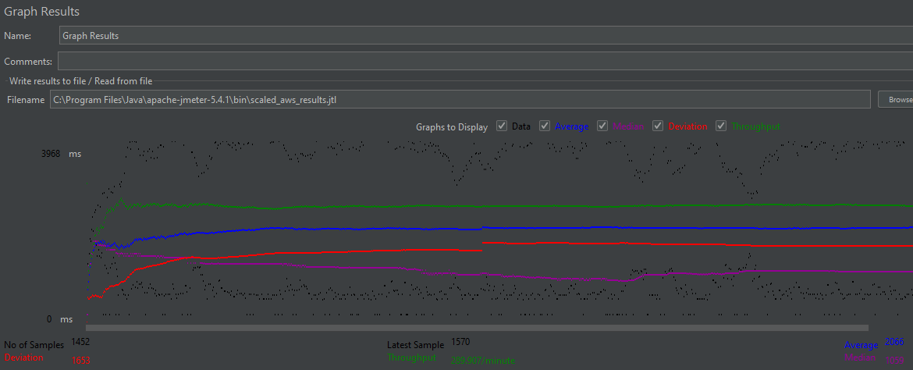

- # General

  - #### Team#: 5

  - #### Names: Tristin Bui, Soobin Woo

  - #### Project 5 Video Demo Link:

  - #### Instruction of deployment:

    Deploying our application with Tomcat involved packaging our maven project
    which resulted in a war file being created that can moved into the tomcat
    webapp directory which can post the live web application on the tomcat
    server.

  - #### Collaborations and Work Distribution:
    Tristin Bui: SQL Master-Slave Replication, Load Balancing, JMeter
    Soobin Woo: Connection Pooling, TS/TJ Logs, log_processing script

- # Connection Pooling

  - #### Include the filename/path of all code/configuration files in GitHub of using JDBC Connection Pooling.
    AddMovieServle.java, AddStarServlet.java, EmployeeLoginServlet.java, GenreServlet.java, LoginServlet.java, MetadataServlet.java, MovieServlet.java, MovieSuggestion.java, SingleMovieServlet.java, SingleStarServlet.java
  - #### Explain how Connection Pooling is utilized in the Fabflix code.
    We specify in context.xml to utilize connection pooling for each JDBC DataSource in the servlets. When each servlet runs and needs to connect to the database, it can grab a connection from a preallocated pool of connections that can be utilized to send a query to the database. When the application is done getting the database results, the application will close the connection which will go back to the pool to be used by another datasource.
  - #### Explain how Connection Pooling works with two backend SQL.
    The two backend SQLS are the master instance which reads/writes and the slave instance which reads in which each resource acts as our connection pool. Our main instance uses Apache to send requests to either the master or slave instances which is possible because of the load balancer member that was added to both slave and master instances.

- # Master/Slave

  - #### Include the filename/path of all code/configuration files in GitHub of routing queries to Master/Slave SQL.

  - #### How read/write requests were routed to Master/Slave SQL?

- # JMeter TS/TJ Time Logs

  - #### Instructions of how to use the `log_processing.*` script to process the JMeter logs.
    Ensure that the log files are in the same directory as the log_processing.java script if it is not already. Compile log_processing.java and run the file.

- # JMeter TS/TJ Time Measurement Report

| **Single-instance Version Test Plan**         | **Graph Results Screenshot**  | **Average Query Time(ms)** | **Average Search Servlet Time(ms)** | **Average JDBC Time(ms)** | **Analysis** |
| --------------------------------------------- | ----------------------------- | -------------------------- | ----------------------------------- | ------------------------- | ------------ |
| Case 1: HTTP/1 thread                         |  | 546                        | 322.810896                          | 322.760726                | ??           |
| Case 2: HTTP/10 threads                       |  | 3927                       | 476.618717                          | 476.518858                | ??           |
| Case 3: HTTPS/10 threads                      |  | 3878                       | 487.04293                           | 486.969947                | ??           |
| Case 4: HTTP/10 threads/No connection pooling |  | 4122                       | 664.201858                          | 643.614553                | ??           |

| **Scaled Version Test Plan**                  | **Graph Results Screenshot**         | **Average Query Time(ms)** | **Average Search Servlet Time(ms)** | **Average JDBC Time(ms)** | **Analysis** |
| --------------------------------------------- | ------------------------------------ | -------------------------- | ----------------------------------- | ------------------------- | ------------ |
| Case 1: HTTP/1 thread                         |  | 551                        | 327.542128                          | 327.293109                | ??           |
| Case 2: HTTP/10 threads                       |  | 2066                       | 285.730807                          | 285.60584                 | ??           |
| Case 3: HTTP/10 threads/No connection pooling |  | 2284                       | 317.665049                          | 301.53230                 | ??           |
